# Project Architecture Analysis

This document provides a detailed technical and workflow analysis of the Supply Chain Management System.

## 1. Technical Architecture

The system implements a **Real-Time Logistics Platform** using a modern **MERN-like Stack** (PostgreSQL replaces Mongo).

### High-Level Topology

```mermaid
graph TB
    %% Styling Definitions
    classDef frontend fill:#e3f2fd,stroke:#1565c0,stroke-width:2px,color:#0d47a1
    classDef backend fill:#f3e5f5,stroke:#7b1fa2,stroke-width:2px,color:#4a148c
    classDef database fill:#e8f5e9,stroke:#2e7d32,stroke-width:2px,color:#1b5e20
    classDef external fill:#fff3e0,stroke:#e65100,stroke-width:2px,color:#bf360c
    classDef protocol stroke-dasharray: 5 5, color:#666
    
    subgraph Client ["🖥️ Frontend & Client Layer"]
        direction TB
        ReactApp["⚛️ <b>React 19 App</b><br/>(Vite, TailwindCSS)"]
        Redux["📦 <b>Redux Toolkit</b><br/>(State Management)"]
        Leaflet["🗺️ <b>Leaflet / Google Maps</b><br/>(Visualization)"]
        APIC["📡 <b>Axios</b><br/>(REST Client)"]
        SocketC["🔌 <b>Socket.IO Client</b><br/>(Real-Time)"]
        
        ReactApp --> Redux
        ReactApp --> Leaflet
        ReactApp --> APIC
        ReactApp --> SocketC
    end

    subgraph Server ["⚙️ Backend & Service Layer"]
        direction TB
        Express["🚀 <b>Express API</b><br/>(Node.js)"]
        Auth["🛡️ <b>Auth Middleware</b><br/>(JWT, Role-Based)"]
        PrismaService["💎 <b>Prisma Client</b><br/>(ORM)"]
        SocketS["⚡ <b>Socket.IO Server</b><br/>(Event Broadcasting)"]
        Synergy["🔄 <b>Synergy Monitor</b><br/>(Background Service)"]
        
        Express --> Auth
        Express --> PrismaService
        SocketS -.-> Express
        Synergy --> SocketS
        Synergy --> PrismaService
    end

    subgraph Data ["🗄️ Persistence Layer"]
        Postgres[("🐘 <b>PostgreSQL</b><br/>State & Logistics Data")]
    end

    subgraph External ["☁️ External Integrations"]
        GoogleAPI["📍 <b>Google Maps API</b><br/>(Routing & Geocoding)"]
        TwilioAPI["📱 <b>Twilio</b><br/>(SMS Notifications)"]
    end

    %% Connections
    APIC -- "HTTPS / JSON" --> Express
    SocketC -- "WebSocket (WSS)" --> SocketS
    PrismaService -- "TCP / SQL" --> Postgres
    
    %% Service Connections
    Express -- "API Calls" --> GoogleAPI
    Express -- "API Calls" --> TwilioAPI

    %% Class Assignments
    class ReactApp,Redux,Leaflet,APIC,SocketC frontend
    class Express,Auth,PrismaService,SocketS,Synergy backend
    class Postgres database
    class GoogleAPI,TwilioAPI external
```

---

## 2. Operational Workflows

### A. Dynamic Task Assignment & Routing

This workflow creates optimized routes by validating truck capacity, driver experience, and real-time distance.

```mermaid
sequenceDiagram
    participant D as 👤 Dispatcher
    participant FE as 🖥️ Frontend (React)
    participant GM as 📍 Google Maps API
    participant BE as ⚙️ Backend (Node)
    participant DB as 🐘 Database

    Note over D, FE: 1. Selection Phase
    D->>FE: Select Driver & Deliveries
    
    Note over FE, GM: 2. Calculation Phase
    FE->>GM: Request Route (Waypoints)
    GM-->>FE: Return Distance & Path (Polyline)
    
    Note over FE, BE: 3. Submission Phase
    FE->>BE: POST /assign-multi-stop<br/>(Payload: Driver, Truck, Distance, Checkpoints)
    
    Note over BE, DB: 4. Validation Phase
    BE->>DB: Fetch Driver Profile (History)
    DB-->>BE: Driver Stats (Total Km)
    
    alt Short Distance (<300km) & Exp Driver (>500km)
        BE-->>FE: ❌ 400 Error (Workload Balance)
        FE-->>D: Show "Overqualified for Short Route" Toast
    else Valid Assignment
        BE->>BE: Check Truck Capacity (Weight/Vol)
        BE->>DB: Create OptimizedRoute Transaction
        DB-->>BE: Success
        BE-->>FE: ✅ 201 Created (Route Details)
        FE-->>D: Update Map & List
    end
```

### B. Absorption Opportunity (Synergy)

This automated background process identifies and posts backhaul opportunities to optimize empty miles.

```mermaid
graph LR
    %% Styles
    classDef process fill:#e1f5fe,stroke:#01579b,stroke-width:2px,rx:5,ry:5
    classDef decision fill:#fff9c4,stroke:#fbc02d,stroke-width:2px,rx:5,ry:5,color:#333
    classDef automated fill:#f3e5f5,stroke:#7b1fa2,stroke-width:2px,stroke-dasharray: 5 5,rx:5,ry:5

    subgraph Auto ["🤖 Automated Synergy Monitor"]
        direction TB
        Timer((⏰ 2-Min Timer))
        Scan[🔎 Scan for 'Pending' Requests]
        Filter{📅 Created < 24h?}
        Post[📢 Posted as 'Opportunity']
        
        Timer --> Scan
        Scan --> Filter
        Filter -->|Yes| Post
        Filter -->|No| Ignored[❌ Ignore]
    end

    subgraph Manual ["👤 Dispatcher Action"]
        direction TB
        View[👀 View Opportunities]
        Decide{👍 Approve / 👎 Reject}
        Sync[🔄 Update Status: BOTH_ACCEPTED]
        Notify[📱 SMS to Driver]
        
        Post --> View
        View --> Decide
        Decide -->|Approve| Sync
        Sync --> Notify
    end

    class Timer,Scan,Filter,Post,Ignored automated
    class View,Sync,Notify process
    class Decide decision
```

